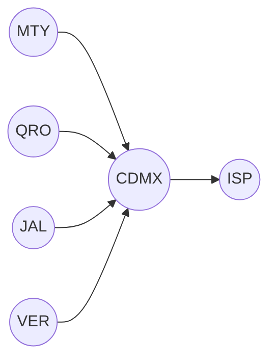

# Redes II
Este es un proyecto realizado para la materia de redes 2 en el que se busca una solución a una solicitud por parte de Grupo Papelero Palermo
en la que se pide la implementación de una red que conecte 4 edificios de trabajo ubicados a lo largo de la república mexicana a uno central
ubicado en la Ciudad de México. 

## Especificaciones
El proyecto se planteó con el uso de una red tipo Hub and Spoke en donde los 4 nodos comparten una estructura predeterminada y requisitos: 
- Hosts: Cada uno de los edificios debe de contar con la posibilidad de tener 260 hosts.
- Servicios: La red también fue diseñada para contar con servicio DNS, SMTP, WEB e Intranet.
- VLAN's: La red debe segmentarse en varias VLAN's para su correcta administración.
- Ruteo: El ruteo solicitado para este proyecto es estatico.
- Administración: La administración remota de equipos debe de poder realizarse a distancia (Telnet por limitaciones del simulador).

## Organización de la empresa
[]
